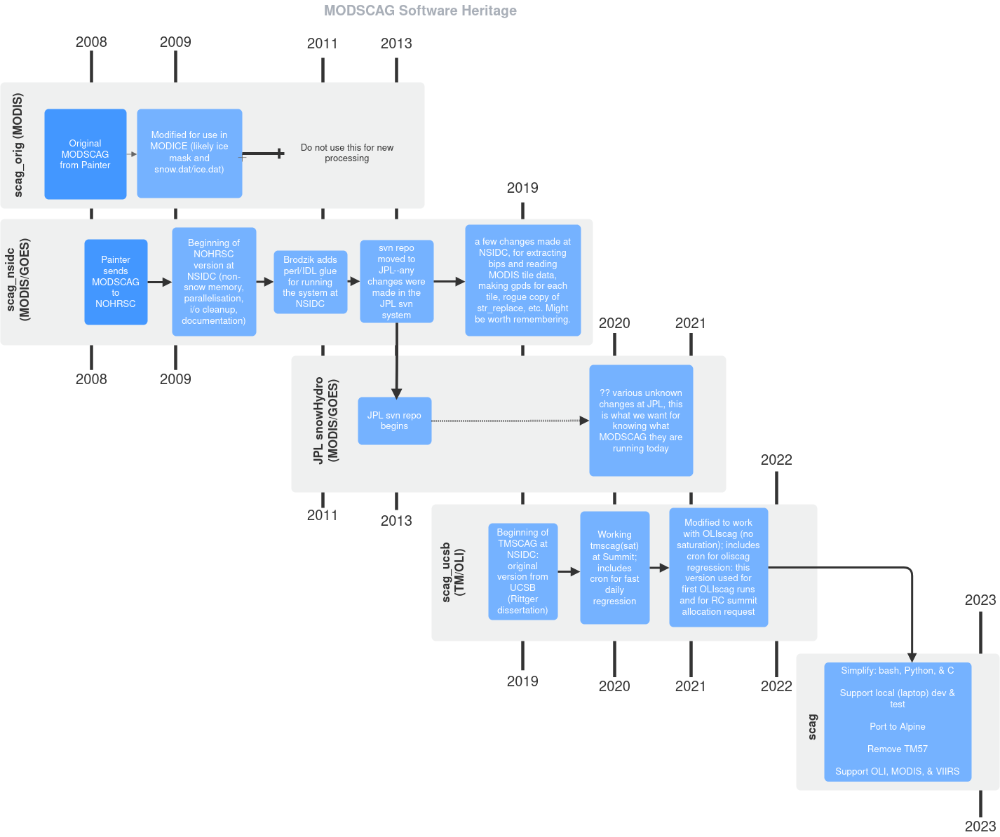

* Table of contents                               :toc_2:noexport:
- [[#how-to-install-and-run-scag][How to install and run SCAG]]
- [[#scag-internals-documentation][SCAG internals documentation]]
- [[#scag-software-heritage][SCAG software heritage]]

* How to install and run SCAG

See the top level README at https://github.com/nsidc/scag/blob/main/README.org

* SCAG internals documentation

The =FSCA_documentation.doc= file provides comprehensive documentation on the internals of the SCAG software. It was generated during the =scag_nsidc= period (see figure) in 2010 and is therefore slightly out of date.

* SCAG software heritage

This file is an *editable PNG* from http://draw.io. To modify it, upload the PNG to that site.

